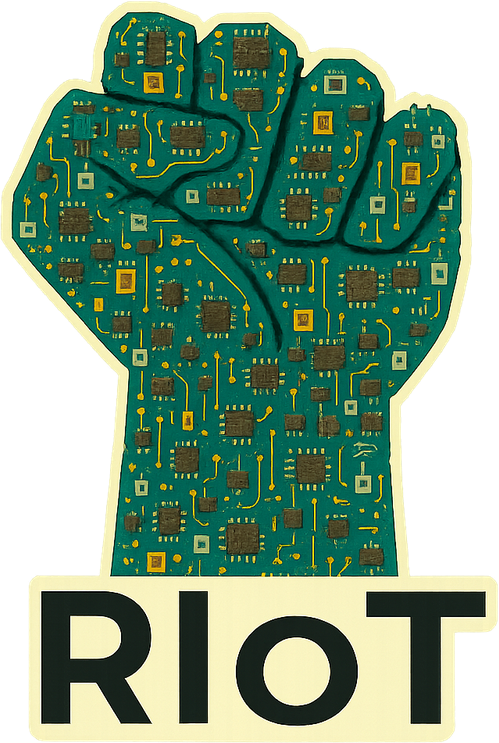

<div align="center">
  
</div>

# RIoT

[](https://goreportcard.com/report/github.com/fabianopinto/riot)
[](LICENSE)
[](go.mod)

A Go project built following best practices for open-source development.

## Table of Contents

- [Installation](#installation)
- [Usage](#usage)
- [Development](#development)
- [Contributing](#contributing)
- [License](#license)

## Installation

### Prerequisites

- Go 1.25 or higher
- Git

### Using go install

```bash
go install github.com/fabianopinto/riot/cmd/riot@latest
```

### Building from source

```bash
git clone https://github.com/fabianopinto/riot.git
cd riot
make build
```

## Development

See [DEVELOPMENT.md](docs/DEVELOPMENT.md) for detailed development instructions.

### Quick Start

```bash
# Clone the repository
git clone https://github.com/fabianopinto/riot.git
cd riot

# Install dependencies
go mod download

# Run tests
make test

# Build
make build

# Run locally
./bin/riot
```

### Project Structure

```
.
├── cmd/                # Command-line applications
│   └── riot/           # Main application entry point
├── internal/           # Private application code
│   └── app/            # Application logic
├── pkg/                # Public library code
├── configs/            # Configuration files
├── scripts/            # Build and utility scripts
├── docs/               # Documentation
├── .github/            # GitHub specific files (workflows, templates)
└── Makefile            # Build automation
```

## Contributing

We welcome contributions! Please see [CONTRIBUTING.md](CONTRIBUTING.md) for details on:

- Code of Conduct
- Development workflow
- Pull request process
- Coding standards

## License

This project is licensed under the MIT License - see the [LICENSE](LICENSE) file for details.

## Acknowledgments

- [golang-standards/project-layout](https://github.com/golang-standards/project-layout) for project structure guidance
- Contributors and maintainers

## Support

- **Issues**: [GitHub Issues](https://github.com/fabianopinto/riot/issues)
- **Discussions**: [GitHub Discussions](https://github.com/fabianopinto/riot/discussions)
